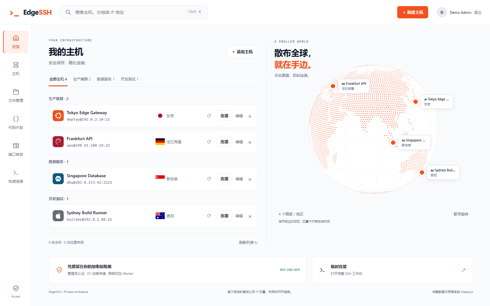
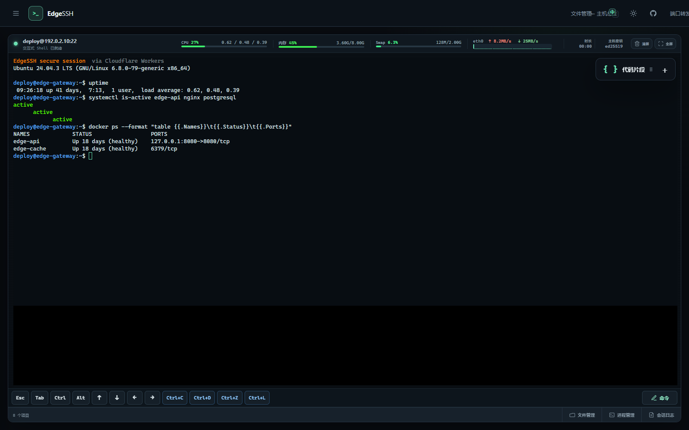
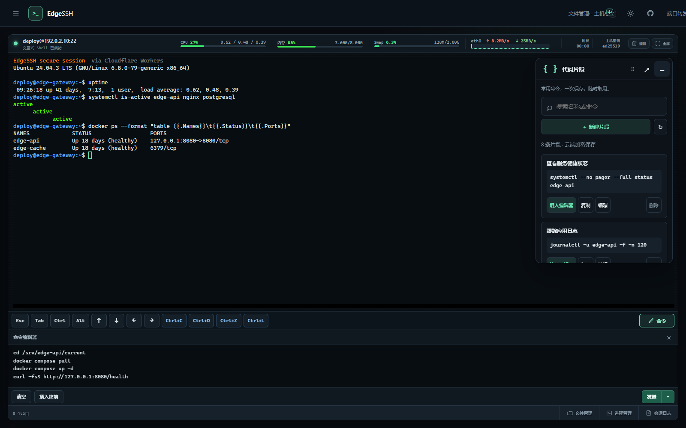
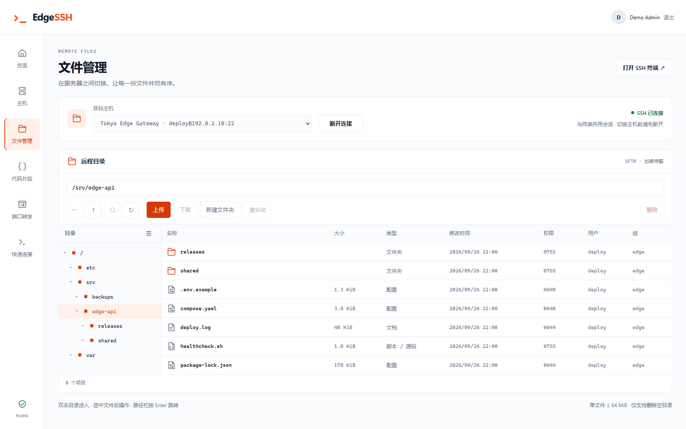
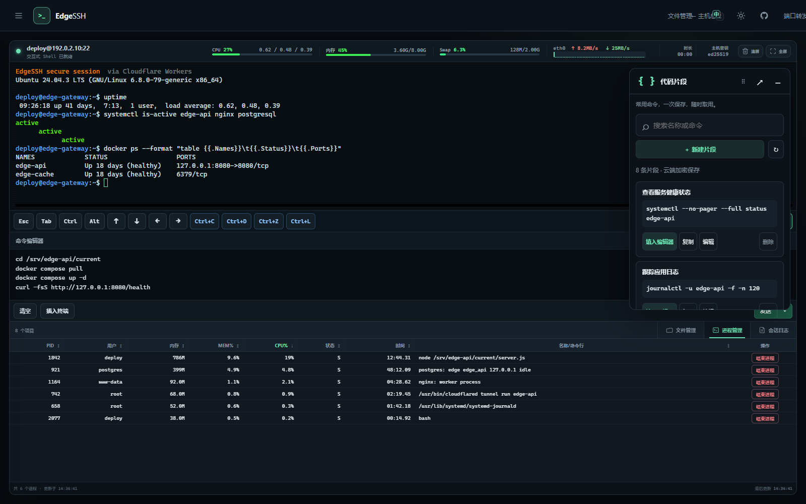
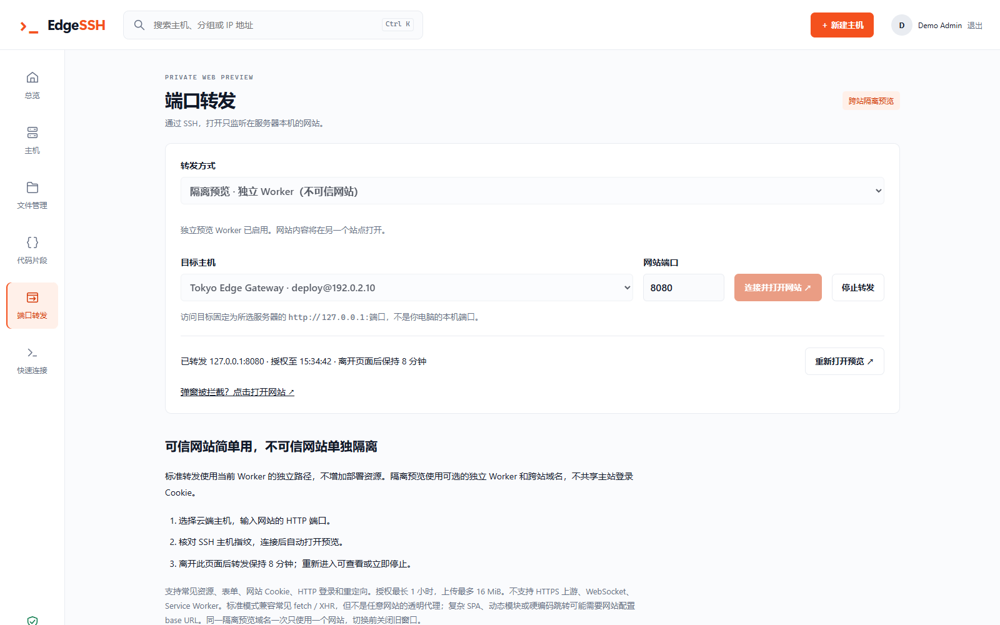
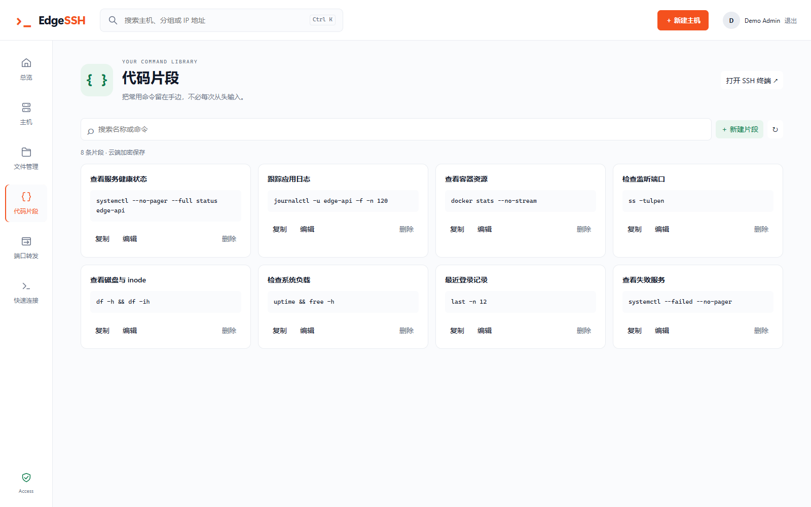
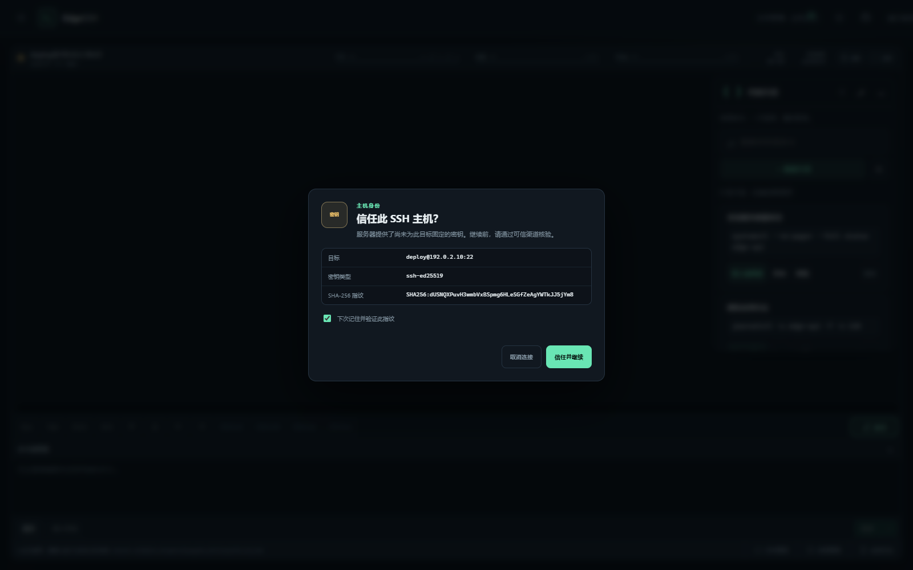

<div align="center">

# EdgeSSH

### 你的 SSH 工作台，跑在 Cloudflare 上。

**把主机、终端、文件、监控与远程访问，收进一个只属于你自己的 WebSSH 工作台。**

Cloudflare-native · Self-hosted · Single-admin · Open source

<br />

[](https://workers.cloudflare.com/)
[](https://www.typescriptlang.org/)
[](LICENSE)
[](https://edgessh-docs.pages.dev/)

<br />

**[快速部署](https://edgessh-docs.pages.dev/)** ·
[功能特性](#功能特性) ·
[安全设计](#安全设计) ·
[本地开发](#本地开发) ·
[文档站 →](https://edgessh-docs.pages.dev/)

<br />



<sub>全部演示数据使用文档保留地址与虚构信息，不对应任何真实服务器。</sub>

<br />

**你的服务器 · 你的凭据 · 你的 Cloudflare · 你的 SSH 工作台**

</div>

---

## 为什么是 EdgeSSH？

SSH 客户端不少，WebSSH 也算不上新鲜。

EdgeSSH 想解决的是另一件事：

> **能不能不再维护一套 SSH 中转服务器，却依然拥有一个随时能从浏览器打开的个人 SSH 工作台？**

EdgeSSH 把 WebSSH 的连接层、主机管理与工作台界面，一起部署在 Cloudflare 上。

浏览器只负责交互；应用逻辑与认证交给 Cloudflare Worker；每一个 SSH 会话都由独立的 Durable Object 承载，再通过 Cloudflare TCP Sockets 连到你的服务器。

<table>
<tr>

<td width="25%" valign="top">

### ☁️ Cloudflare Native

跑在 Cloudflare Workers 上。

不用再单独维护一台 WebSSH 中转 VPS。

</td>

<td width="25%" valign="top">

### 🧰 SSH Workspace

不只是一个 Terminal。

主机、文件、进程、代码片段和远程服务，都在同一个工作台里。

</td>

<td width="25%" valign="top">

### 🔐 Self-hosted

部署在你自己的 Cloudflare 账户里。

数据库、Worker 和配置，全部由你掌控。

</td>

<td width="25%" valign="top">

### 👤 Single Admin

面向个人服务器管理场景。

没有多租户、没有成员系统，也没有复杂的权限模型。

</td>

</tr>
</table>

<div align="center">

**它不只是塞进浏览器里的一个 Terminal。**

### 它是部署在 Cloudflare 上的个人 SSH 工作台。

</div>

---

# 功能特性

## 一个地方，管好你所有的服务器

EdgeSSH 把散落各处的服务器连接信息，收进统一的主机库。

在这里你可以：

- 保存、编辑服务器信息
- 搜索与整理主机
- 记录系统类型与服务器所在地
- 从 Dashboard 直接跳进 SSH
- 用密码或 SSH 私钥认证
- 在不同设备间访问同一份工作区

主机资料与连接凭据会先用 **AES-256-GCM** 加密，再写入 D1。

---

## 🖥️ Terminal

**打开浏览器，就是进了服务器。**



基于 xterm.js 的交互式终端，支持：

- SSH 2.0
- PTY
- 窗口尺寸同步
- Keepalive
- 全屏终端
- UTF-8 / GB18030 / Big5
- 密码认证
- keyboard-interactive
- OpenSSH 私钥认证



第一次连接某台服务器时，EdgeSSH 会先展示它的 **SHA-256 Host Key Fingerprint**。

只有你确认无误后，才会继续发送 SSH 凭据。

---

## 📁 File Manager

**不必为了改一个文件,再多开一个工具。**



EdgeSSH 内置了一个基于 SFTP 的文件管理器：

- 浏览服务器目录
- 上传与下载
- 新建文件夹
- 重命名
- 删除文件
- 键盘导航
- 文件类型图标
- 从文件管理器直接跳回 SSH Terminal

Terminal 与 File Manager 共用同一个 SSH 会话，切换之间不必重新连接。

---

## 📊 Server Monitor



在 SSH 会话里就能直接看到：

**CPU · Load · Memory · Swap · Processes · OS · Architecture**

不需要跳出工作台,也不需要在服务器上额外装一个 Agent。

---

## 🔌 Port Forwarding

服务器上有些服务只监听：

```text
127.0.0.1:3000
```

在 EdgeSSH 里,同样可以打开它。



EdgeSSH 能借助已有的 SSH 会话,访问服务器本地的 HTTP 服务,并在浏览器里给出一个临时预览。

适合这些场景:

**开发服务器 · 本地 Dashboard · 管理面板 · 调试接口**

如果要打开的是一个不太信任的网页,可以改用独立的 Preview Worker,把预览页面和 EdgeSSH 管理界面隔离开来。

> Port Forwarding 不是一个通用反向代理。WebSocket、HTTPS 上游以及部分复杂 Web 应用,目前还有一些限制。

[查看端口转发与安全说明 →](https://edgessh-docs.pages.dev/)

---

## 📝 Code Snippets



把常用命令存下来:

```bash
docker ps
df -h
free -h
journalctl -xe
```

需要的时候:

**搜索 → 填入 Terminal → 检查一遍 → 执行**

代码片段通过 D1 同步,而不是只存在某一个浏览器里。

---

## 🌍 服务器,也可以从地球上看

EdgeSSH 会根据服务器的公网 IP,估算出大致地理位置,并画在 Dashboard 的地球上。

点一下主机,就能从地图直接跳进对应的服务器。

地球组件用的是轻量的 Canvas 球面投影,没有引入 Three.js 这类较重的 3D Runtime。

> 地理位置仅用于可视化展示,不代表服务器的实时在线状态。

---

# 一套工作台,多种服务器管理方式

```text
                         EdgeSSH
                            │
        ┌───────────────────┼───────────────────┐
        │                   │                   │
      Hosts              Workspace           Tools
        │                   │                   │
    Credentials          Terminal          File Manager
      Groups              SFTP             Monitoring
    Locations           Sessions           Snippets
        │                   │             Port Forward
        └───────────────────┼───────────────────┘
                            │
                       Your Servers
```

不管你手上是:

**VPS · Cloud VM · NAS · Home Server · Development Machine**

只要它能通过公网 SSH 访问,就可以加入 EdgeSSH。

---

# Cloudflare-native

EdgeSSH 不需要你另外部署一套 WebSSH Backend。

```text
Browser
│
│ HTTPS / WebSocket
▼
Cloudflare Worker
│
├── Authentication
├── Host Management
├── Encrypted Storage ──────→ D1
├── Static App / API
│
└── Session Ticket
        │
        ▼
Durable Object
│
│ Cloudflare TCP Socket
▼
SSH Server
```

SSH 握手、认证、密钥交换以及 Channel 通信,都在 Worker 一侧完成。

浏览器实际连接的是你的 EdgeSSH Worker,而不是直接跟目标服务器建立 TCP 连接。

### 用到的 Cloudflare 能力

**Workers**

跑起 EdgeSSH 的应用、API 与 SSH 协议逻辑。

**Durable Objects**

给每个 SSH 会话一份独立的生命周期与 WebSocket 状态。

**D1**

存放加密后的主机资料、管理员信息和代码片段。

**TCP Sockets**

从 Cloudflare 网络出发,建立到 SSH Server 的 TCP 连接。

---

# 认证

EdgeSSH 是一个 **Single-admin Workspace**。

它不是 SaaS 多租户系统,没有成员、组织,也没有角色权限。

目前支持两种登录方式:

<table>
<tr>

<td width="50%" valign="top">

### GitHub OAuth

适合想快速部署的用户。

用指定的 GitHub 账号,作为唯一的管理员身份。

**不需要 Cloudflare Zero Trust。**

</td>

<td width="50%" valign="top">

### Cloudflare Access

适合已经在用 Cloudflare Zero Trust 的用户。

可以用邮箱 OTP,也可以接入已有的 Identity Provider。

</td>

</tr>
</table>

两种方式二选一即可。

切换认证 Provider 不会新建一个用户工作区,也不会重新生成一份主机资料库。

---

# 安全设计

服务器管理工具天生要经手高权限凭据,所以 EdgeSSH 一直在尽量收窄默认的攻击面。

### 加密存储

主机密码、私钥以及相关敏感资料,都会用 **AES-256-GCM** 加密后再存进 D1。

浏览器不会长期保存 SSH 凭据。

### Host Key Verification

第一次连接服务器,必须确认 SSH Host Key Fingerprint。

指纹一旦发生变化,会再次要求你确认。



### Single-admin

EdgeSSH 不开放注册,也没有多租户的数据隔离逻辑。

整个实例只属于一个管理员工作区。

### Session Isolation

每个 SSH 会话都由 Durable Object 单独管理。

会话入口使用临时票据,辅助连接也会做身份检查。

### SSRF Protection

连接目标必须解析到允许访问的公网地址,并且会在建立连接前检查解析结果。

---

## 信任边界

EdgeSSH **不是一个端到端加密的 SSH Gateway**。

Worker 本身就是真正的 SSH Client,建立连接时必然要处理 SSH 凭据和会话数据。

所以:

> **请只把 EdgeSSH 部署在你自己信任、自己掌控的 Cloudflare 账户里。**

同时建议给服务器上的 SSH 用户,配置刚好够用的最小权限。

---

# 快速部署

最推荐的方式是:

### 01 · Fork

把 EdgeSSH Fork 到你自己的 GitHub 账号下。

### 02 · 选择认证方式

二选一:

```text
GitHub OAuth
```

或者:

```text
Cloudflare Access
```

### 03 · 添加 Cloudflare Token

在 GitHub Actions Secrets 里,加入你的 Cloudflare API Token。

### 04 · Run workflow

运行 Deploy Workflow。

剩下的交给 EdgeSSH 自动完成:

**Worker → Durable Object → D1 → Migration → Secrets → Deployment**

不用你手动去复制:

```text
D1 Database ID
Access AUD
Team Domain
Random Encryption Key
```

<div align="center">

### [查看完整部署指南 →](https://edgessh-docs.pages.dev/)

认证配置、API Token 权限、自定义域名、Preview Worker、升级与迁移,都在文档站里有详细说明。

</div>

---

# 当前支持

| 能力 | 支持情况 |
| --- | --- |
| SSH | SSH 2.0 / Shell / PTY / Resize / Keepalive |
| SFTP | SFTP v3 |
| Password | ✅ |
| keyboard-interactive | ✅ 单密码提示 |
| Ed25519 | ✅ |
| RSA | ✅ |
| ECDSA | ✅ P-256 / P-384 / P-521 |
| File Manager | ✅ |
| Process Monitor | ✅ |
| OS Detection | ✅ |
| Code Snippets | ✅ |
| HTTP Port Forward | ✅ |
| Multiple Admins | ❌ |
| SCP | ❌ |
| ProxyJump | ❌ |
| SSH Agent | ❌ |
| Encrypted Private Keys | 暂不支持 |

单一管理员工作区,最多可以保存 **200 台主机**。

SFTP 单文件上传和下载的上限是 **64 MiB**。

---

# 端口转发安全

EdgeSSH 的 Port Forward 提供两种模式。

### Trusted

直接走 EdgeSSH 主 Worker。

适用于:

> **你自己开发、自己部署、自己信得过的网页。**

这种模式和 EdgeSSH 管理界面共享浏览器 Origin,所以不建议用来打开不可信的站点。

### Isolated

通过独立的 Preview Worker 提供页面。

适用于:

> **没法完全信任的远程 Web 应用。**

Preview Worker 和 EdgeSSH 主界面运行在不同的 Origin 上,能减少被代理页面反过来调用管理 API 的风险。

完整的安全模型、生命周期、Cookie 处理和当前的代理兼容范围,请看:

**[EdgeSSH 文档站 →](https://edgessh-docs.pages.dev/)**

---

# 本地开发

Requirements:

```text
Node.js >= 22.12
npm
Cloudflare Wrangler
```

Clone:

```bash
git clone https://github.com/aozorae/EdgeSSH.git
cd EdgeSSH

npm ci
cp .env.example .dev.vars
npx wrangler d1 migrations apply DB --local
npm run dev
```

前端开发:

```bash
npm run dev:web
```

### 常用命令

| Command | Description |
| --- | --- |
| `npm run dev` | Build frontend and start local Worker |
| `npm run dev:web` | Start Vite frontend |
| `npm run build:web` | Build frontend |
| `npm run typecheck` | TypeScript check |
| `npm test` | Run tests |
| `npm run test:browser` | Browser regression tests |
| `npm run showcase` | Regenerate privacy-safe README screenshots with local Chrome |
| `npm run check` | Full validation |
| `npm run deploy` | Deploy to Cloudflare |

---

# 项目结构

```text
EdgeSSH/
├── .github/workflows/    GitHub Actions deployment
├── frontend/             Web workspace
├── src/
│   ├── accounts/         Authentication & encrypted storage
│   ├── backend/          Sessions, SFTP & system detection
│   ├── ssh/              SSH protocol implementation
│   └── worker.ts         Worker entry
├── migrations/           D1 migrations
├── tests/                Tests
├── DEPLOYMENT.md         Deployment documentation
└── wrangler.toml         Cloudflare configuration
```

---

# 上游项目

EdgeSSH 基于:

### [Worker Web SSH / CF-Workers-WebSSH](https://github.com/cmliu/CF-Workers-WebSSH)

持续开发而来。

在原有的 Cloudflare WebSSH 能力之上,EdgeSSH 又加上了:

**Host Management · Encrypted Storage · File Manager · Monitoring · GitHub OAuth · Port Forwarding · Code Snippets · Globe Visualization**

感谢原作者 **CM / cmliu** 打下的这份开源基础。

---

# 特别致谢

特别感谢 [Linux.do 社区](https://linux.do/) 对 EdgeSSH 推广的支持，让 EdgeSSH 有机会在社区内发帖分享与交流。

---

# Contributing

欢迎提交:

**Issues · Bug Reports · Pull Requests · Documentation Improvements**

提交代码前,请先跑一遍:

```bash
npm run check
```

涉及 SSH、SFTP 或 Port Forward 的改动,请用你自己拥有授权的服务器来测试。

提交 Issue 时,有一件事拜托一定注意:

> **请不要上传密码、SSH 私钥、Access Token,或是包含敏感信息的日志。**

---

# Acknowledgements

- [cmliu/CF-Workers-WebSSH](https://github.com/cmliu/CF-Workers-WebSSH) — EdgeSSH 的直接上游
- [huashengdun/webssh](https://github.com/huashengdun/webssh) — WebSSH 与前端 API 参考
- [newbietan/CloudSSH](https://github.com/newbietan/CloudSSH) — Cloudflare Workers SSH 实现参考
- [crazypeace/huashengdun-webssh](https://github.com/crazypeace/huashengdun-webssh) — WebSSH 二次开发参考

---

# License

EdgeSSH is licensed under the [Apache License 2.0](LICENSE).

使用、修改与分发时,请保留适用的许可证与版权声明。

---

<div align="center">

# EdgeSSH

### SSH infrastructure doesn't need another server to manage it.

**Your servers · Your credentials · Your Cloudflare · Your workspace**

<br />

**[Deploy EdgeSSH →](https://edgessh-docs.pages.dev/)** · [📚 完整文档](https://edgessh-docs.pages.dev/)

</div>
